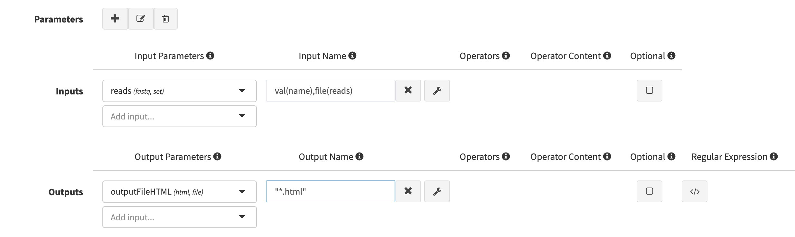
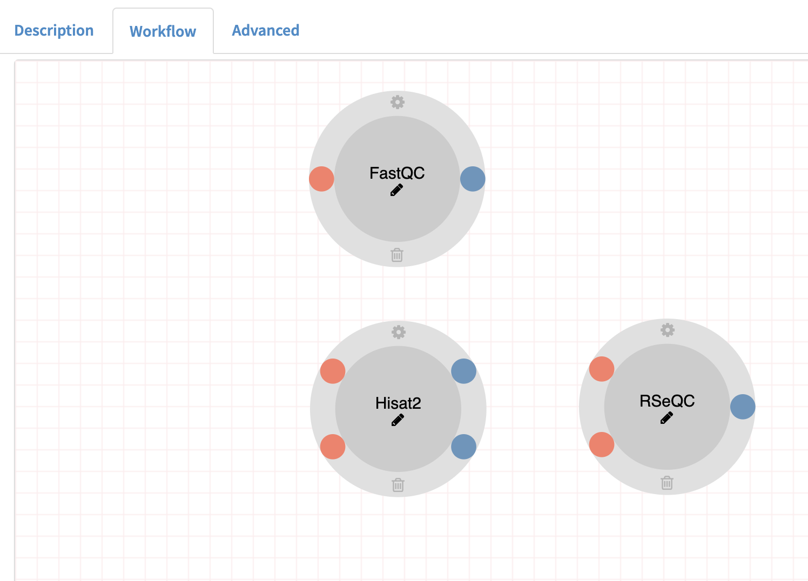
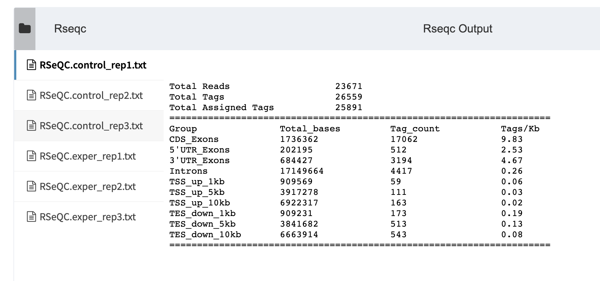

Introduction
=========

Via Foundry is an easy-to-use platform for creating, deploying, and executing complex nextflow pipelines for high throughput data processing.

Foundry provides: 
--------

1. A drag and drop user interface to build nextflow pipelines
2. Reproducible pipelines with version tracking 
3. Seamless portability to different computing environments with containerization
4. Simplified pipeline sharing using GitHub (github.com)
5. Support for continuous integration and tests (travis-ci.org)
6. Easy re-execution of pipelines by copying previous runs settings
7. Integrated data analysis and reporting interface with R markdown support

Our aim is;
--------

1. Reusability
2. Reproducibility
3. Shareability
4. Easy execution
5. Easy monitoring
6. Easy reporting


Expected learning outcome
========

To understand the basics of Foundry, how to use pipeline builder for different objectives and to familiarize yourself with Nextflow and some standard software packages for such analysis.

Overview
========
  * [Before you start](#before-you-start)
  * [Getting Started](#getting-started)
  * [Exercise 1: Creating processes](#exercise-1---creating-processes)
    * [FastQC process](#1-fastqc-process)
    * [Hisat2 process](#2-hisat2-process)
    * [RSeQC process](#3-rseqc-process)
  * [Exercise 2: Building a pipeline](#exercise-2---building-a-pipeline)
  * [Exercise 3: Running a pipeline](#exercise-3---executing-a-pipeline)

# Before you start

Please go to https://dev.viafoundry.net and login into your account. If you have an issue about login, please let us know about it (support@viascientific.com). We will set an account for you.

# Tutorial guide

This guide will walk you through how to start using Foundry pipelines and creating new pipelines.

## Exercise 1 - Creating processes

Once logged in, click on the `Projects` section at the top menu and click `Add a New Project` button. This is the place to configure your project. To access pipeline builder page, click `Pipelines` tab and then click `Create Pipeline` button. 


Now you can write a descripton about your pipeline using `Description` tab, start developing your pipeline using `Workflow` tab, and adding extra files or setting some extra parameters using `Advanced` tab. Let's get into some details about the pipeline elements.


### What is a "process"?

Process is a basic programming element in Nextflow to run user scripts. Please [click here](https://www.nextflow.io/docs/latest/process.html) to learn more about Nextflow's processes.

A process usually has inputs, outputs and script sections. In this tutorial, you will see sections that include necesseary information to define a process shown in the left side of the picture below. Please, use that information to fill "Add new process" form shown in the middle section in the picture below. Foundry will then convert this information to a nextflow process shown in the left side of the picture. Once a process created, it can be used in the pipeline builder. The example how it looks is shown in the bottom left side in the picture. The mapping between the sections shown in colored rectangles.      


### The process we will create in this exercise;

1. FastQC process
2. Hisat2 process
3. RSeQC process

You’ll notice several buttons at the left menu. New processes are created by clicking blue `New process` button .

### 1. FastQC process
**a.** First, please click, blue `New process` button  in the left menu to open "Add New Process" window.

**b.** Please enter FastQC for the process name and define a new "Menu Group". 


**c.** In the FastQC process, we have an input, an output and a line of a command we are going to use to execute the fastqc process.

```
Name: "FastQC"
Menu Group: "Tutorial"
Inputs: 
  reads(fastq,set) name: val(name),file(reads)
  
Outputs: 
  outputFileHTML(html,file) name: "*.html"
  
Script:
  fastqc ${reads}
```  

**d.** Lets select input and output parameters (`reads` and `outputFileHTML`) and define their "Input Names" that we are going to use in the script section.


 
**e.** Let's enter the script section


**f.** Press "Save changes" button at the bottom of the modal to create the process. Now this process is ready to use. We will use it in the Exercise 2.

### 2. Hisat2 process

Let's create Hisat2 process. 

**a.** First, please click, blue “New process” button to open "Add New Process" modal.

**b.** Inputs, outputs and scripts should be defined like below;

```
Name: "Hisat2"
Menu Group: "Tutorial"
Inputs: 
  reads(fastq,set) name: val(name),file(reads)
  hisat2Index(file) name: hisat2Index
      
Outputs: 
  mapped_reads(bam,set) name: val(name), file("${name}.bam")
  outputFileTxt(txt,file) name: "${name}.align_summary.txt"

Script:
  basename=\$(basename ${hisat2Index}/*.8.ht2 | cut -d. -f1)
  hisat2 -x ${hisat2Index}/\${basename} -U ${reads} -S ${name}.sam &> ${name}.align_summary.txt
  samtools view -bS ${name}.sam > ${name}.bam 

```

**c.** After you select input output parameters (`hisat2IndexPrefix`, `mapped_reads` and `outputFileTxt` parameters), add their names and enter the script. The page should look like this;


**d.** Please save changes before you close the screen.

### 3. RSeQC process

**a.** First, please click, blue “New process” button to open "Add New Process" modal.

**b.** The form should be filled using the information below;

```
Name: "RSeQC"
Menu Group: "Tutorial"
Inputs:
  mapped_reads(bam,set) name: val(name), file(bam)
  bedFile(bed,file) name: bed
  
Outputs: 
  outputFileTxt(txt,file) name: "RSeQC.${name}.txt"
  
Script:
  read_distribution.py  -i ${bam} -r ${bed}> RSeQC.${name}.txt
```

**c.** After you select input output parameters, enter their names and the script. The page should look like this;


**d.** Please, save changes before you close the screen.

Here Exercise 1 is finished. Please move to Exercise 2 to build the pipeline using the processes you created in Exercise 1. 

## Exercise 2 - Building a pipeline

Before you start building the pipeline make sure you have the processes available in your Process Menu.


**a.** At the top of the page, you’ll notice `Pipeline Name` box. You can rename your pipeline by clicking here. Please enter a name to your pipeline. E.g. "RNA-Seq-Tutorial" and press save button.


**b.** Please drag and drop FastQC, Hisat2 and RSeQC to your workspace;



**c.** Please drag and drop three `Input parameters` and change their names to `Input_Reads`, `Hisat2_Index` and `bedFile` and connect them to their processes;  


**d.** Connect your Hisat2 process with RSeQC process using mapped_reads parameter in both. You will observe that, when the types match you can connect the two processes using their matching input and output parameters.

**e.** Drag & Drop three `output parameters` from the sidebar 


and name them `FastQC_output`, `Hisat2_Summary`, and `RSeQC_output` and connect them to their corresponding processes. While naming, click their "Publish to Web Directory" and choose the right output format according to the output type of the process.
 


**f.** Overall pipeline should look like below;


 
## Exercise 3 - Executing a pipeline

  **1.** Once a pipeline is created, you will notice “Run” button at the right top of the page.


  **2.** This button opens a new window where you can select your project by clicking on the project.
You will then proceed by entering run name which will be added to your run list of the project. Clicking “Save run” will redirect you to the “run page” where you can initiate your run.


  **3.** Here, please choose your `Run Environment` (Via Demo Environment(AWS Batch))
  


  **4.** Then click the `Advanced` tab and go to `Run Container` section. Click `Use Docker Image` and enter the`Image Path` below;
  
<pre>
Run Container:
Use Docker Image: Checked
Image Path: public.ecr.aws/t4w5x8f2/viascientific/rnaseq:3.0


</pre>  


  **5.** Now, we are ready to enter the inputs we defined for the pipeline. 
  Click the `Run Settings` tab to enter bed file. Please choose the "Manually" tab to enter the location of the bed file.
  
```
bedFile:  s3://viascientific/run_data/genome_data/mousetest/mm10/refseq_170804/genes/genes.bed
```

**6.** Second, enter the hisat2 index directory. Please use the "Manually" tab. 
```
Hisat2_Index: s3://viascientific/run_data/genome_data/mousetest/mm10/refseq_170804/Hisat2Index
```

#### Creating Collection
**7.**  To enter Input_Reads, click `Enter File` button. Then go to `Files` Tab and click "Add File" button.


**8.**  Enter the location of your files and click **Search button** to get the list of files: 
  
File Location:
```
s3://viascientific/run_data/test_data/fastq_mouse_single
```


**8.** Then please choose `Single List` for the **Collection Type** and press `add all files` button.

**9.** Here there is an option to change the names but we will keep them as they are. Enter a collection name and click "save files".
```
collection name: test collection
```


**10.** In the next screen, the user can still add or remove some samples. Let's click "Save file" button to process all samples.


**11.** After we fill the inputs, the orange "Waiting" button at the top right should turn to green "Run" button. Now, you can press that button to start your run.

**12.** All run should finish in a couple of minutes. When the run finalized the log section will be look like below;

  **a. Logs**:


  **b. Timeline**:


**13.** In the report section, you can monitor all defined reports in the pipeline;

  **a. FastQC**


  **b. Hisat2**


  **c. RSeQC**



