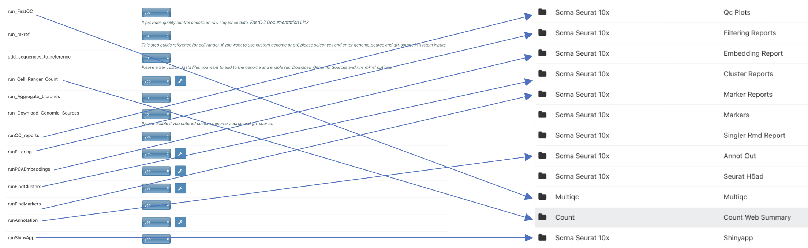

Goal of this document
========

After running the single cell RNA-Seq pipeline, this document can help users to navigate the output of the pipeline.

# Overview

The figure below shows the corresponding between the pipeline steps and output.

 
  

This document will introduce every part of the output shown in this figure.

# MultiQC
## File type
The output file in this section is a html file generated using [multiQC](https://multiqc.info).
## Description
[multiQC](https://multiqc.info) will aggregate the [FastQC](https://www.bioinformatics.babraham.ac.uk/projects/fastqc/) quality control report of each fastq file in the pipeline. The aggregation of multiple FastQC reports helps users to view the quality control of multiple fastq files easily.

 
  

# Count
## File type
The output file in this section is a html file generated by [cellranger pipeline](https://support.10xgenomics.com/single-cell-gene-expression/software/pipelines/latest/what-is-cell-ranger).
## Description

 
  

This html file is a quality control report of single cell RNA-Seq Count Matrix, which include estimated number of cells, alignment/quantification results and preliminary clustering analysis.
In this report there is also a preliminary clustering analysis of the data. The preliminary analysis result can be used as means of quality control because it shows likely cell populations and their gene markers. However, the results from this report may not be accurate.

 
  
