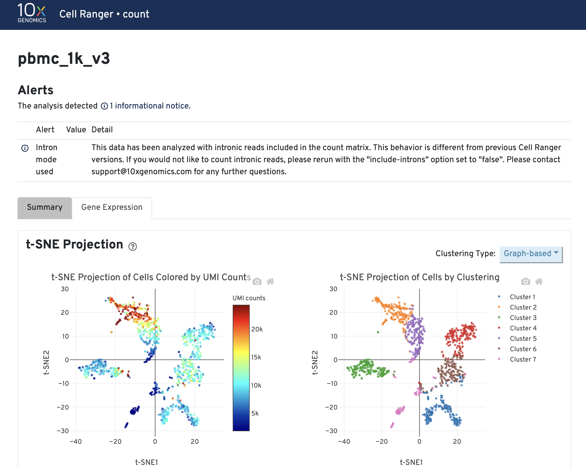
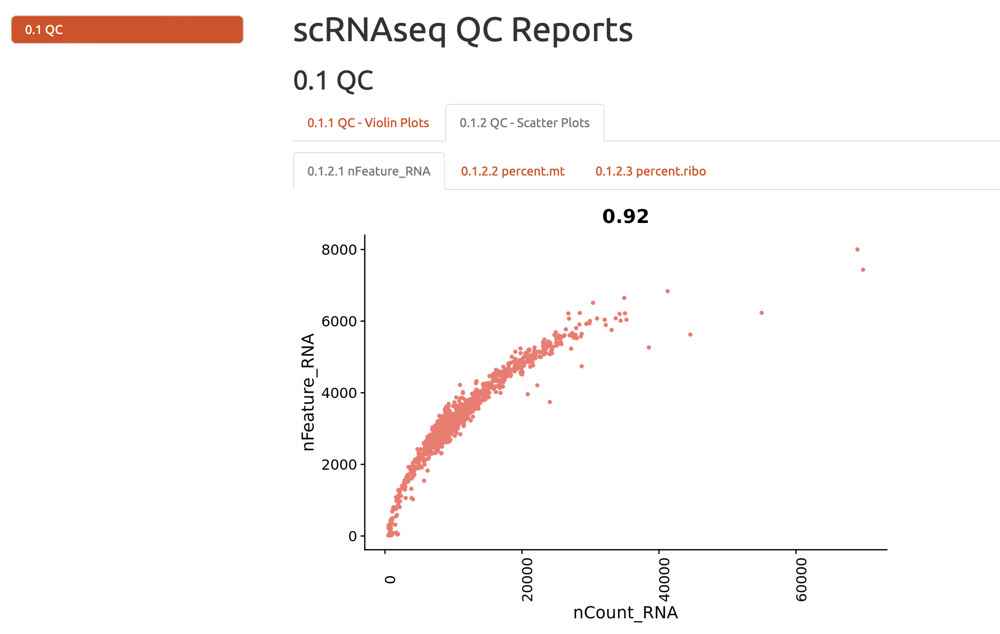
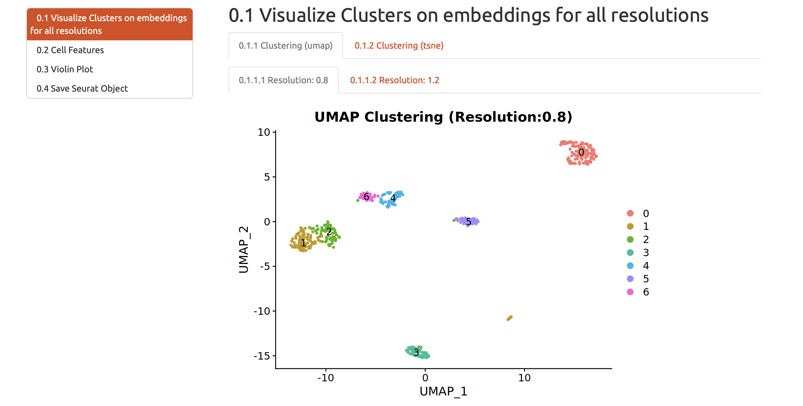

Goal of this document
========

After running the single cell RNA-Seq pipeline, this document can help users to navigate the output of the pipeline.

# Overview

The figure below shows the corresponding between the pipeline steps and output.

 
  

This document will introduce every part of the output shown in this figure.

# Multiqc
## File type
The output file in this section is a html file generated using [multiQC](https://multiqc.info).
## Description
[multiQC](https://multiqc.info) will aggregate the [FastQC](https://www.bioinformatics.babraham.ac.uk/projects/fastqc/) quality control report of each fastq file in the pipeline. The aggregation of multiple FastQC reports helps users to view the quality control of multiple fastq files easily.

 
  

# Count Web Summary
## File type
The output file in this section is a html file generated by [cellranger pipeline](https://support.10xgenomics.com/single-cell-gene-expression/software/pipelines/latest/what-is-cell-ranger).
## Description

 
  

This html file is a quality control report of single cell RNA-Seq Count Matrix, which include estimated number of cells, alignment/quantification results and preliminary clustering analysis.
In this report there is also a preliminary clustering analysis of the data. The preliminary analysis result can be used as means of quality control because it shows likely cell populations and their gene markers. However, the results from this report may not be accurate.

 
  

# Qc Plots
## File type
The output file in this section is a html file generated by [Rmarkdown](https://rmarkdown.rstudio.com). 
## Description
The cellranger software in the pipeline will generate a count matrix from input fastq files. The count matrix will be analyzed using R package [Seurat](https://satijalab.org/seurat/). In this html file the number of genes and number of UMIs ([Unique Molecular Identifiers](https://dnatech.genomecenter.ucdavis.edu/faqs/what-are-umis-and-why-are-they-used-in-high-throughput-sequencing/)) for each cell is plotted using violin plot and scatter plots.

 
  

# Filtering Reports
## File type
The output file in this section is a html file generated by [Rmarkdown](https://rmarkdown.rstudio.com). 
## Description
In this html file the filtering criteria will be shown and the number of cells before and after the filtering will be shown.

 
  

 
  

# Embedding Report
## File type
The output file in this section is a html file generated by [Rmarkdown](https://rmarkdown.rstudio.com). 
## Description
In this html file the dimension reduction results are shown.
In the single cell RNA-Seq analysis there are two layers of dimension reduction: Prinicple component analysis (PCA) and UMAP/tSNE.
### Prinicple component analysis (PCA)
Prinicple component analysis (PCA) is used to reduced the dimensionality of the data. The rationale of this analysis is that not all the genes in the scRNA-Seq data are contributing to the variations in gene expression profiles of cells due to the sparsity of data. PCA uses all the genes in the data and constructs a series of artificial dimensions ("principle components") which are linear combination of the gene expression profiles. 
For each principle component the amount of variation explained and how genes contributed to the principle component are calculated. In the figures below you can see an elbow plot of amount of variation explained: it shows that the amount of variation explained by principle component decreases "exponentially", which means that using the top 15-20 principle components can capture enough differences in the dataset and we can just use these principle components in the downstream analysis.
The heatmap in the figure below shows what and how genes contributed to different principle components. Most of these genes in the figure are immune cell type markers, which means that the principle components are capturing differences between immune cell populations. 

 
  

### Prinicple component analysis (PCA)
Although PCA is very helpful and robust in the dimension reduction and generates biologically meaningful results, it is not good enough for the visualization. For visualization the pipeline generates [tSNE](https://lvdmaaten.github.io/tsne) and [UMAP](https://arxiv.org/abs/1802.03426), which is shown in this section.

 
  

# Cluster Reports, Marker Reports and Markers
## File type
Cluster reports and Marker Reports are two html file generated by [Rmarkdown](https://rmarkdown.rstudio.com). The Markers section provided a tsv file of marker genes for each cluster.
## Description
The unsupervised clustering is used to group cells into populations so users do not need to look at a few thousand cells one at a time. After the clustering, genes that are significantly up and down regulated in each cell population are calculated: these genes can help users to identify the identity of cell populations.
### Cluster Reports
The report will visualize the clustering results, which is shown below.

 
  

Another important visualization is plotting QC metrics of cells against the clustering results. This is to ensure that the clustering results is not significantly biased by the different sequencing depth and coverage of cells in the dataset.

 
  

### Marker Reports
In this section the up-regulated genes in each cell population defined by clustering algorithm are visualized using heatmap. The figure below is an example of such heatmap.

 
  

### Markers
In this section the full list of gene markers of each cell population is ready to be viewed and downloaded.

 
  

# Singler Rmd Report
## File type
Singler Rmd Report and Marker Reports is a html file generated by [Rmarkdown](https://rmarkdown.rstudio.com).
## Description
[SingleR](https://doi.org/10.1038/s41590-018-0276-y) is an algorithm that annotate single cell RNA-Seq dataset based on gene markers of each cell population from clustering and a corresponding reference map. In this section the results of this SingleR annotation are shown.

 
  

# Annot Out, Seurat H5ad and Shinyapp
## File type
In these sections the goal is to visualize end results of single cell RNA-Seq dataset using custom shiny Apps and [cellxgene](https://cellxgene.cziscience.com).

