Expected learning outcome
========

To understand the basics of Metadata Tracking System, and import sample GEO metadata.

# Before you start

Please go to https://www.viafoundry.com and login into your account. If you have an issue about login, please let us know about it (support@viascientific.com). We will set an account for you.

Overview
========
  * [Creating Project and Adding Metadata Tracker](#creating-project-and-adding-metadata-tracker)
  * [Configuring Metadata Tracker](#configuring-metadata-tracker)
  * [Importing Metadata](#importing-metadata)
  * [Basic Commands](#basic-commands)
  * [File transfer from your laptop to cluster using FileZilla](#file-transfer-from-your-laptop-to-cluster-using-FileZilla)
  * [Session1 Homework](#session1-homework)

Creating Project and Adding Metadata Tracker
========

Once logged in, click on the `Projects` section at the top menu and click `Add a New Project` button. Enter your project name and click OK. This is the place to configure your project. Click on the `Add Metadata Tracker` icon to add new `Metadata` tab into your project. 

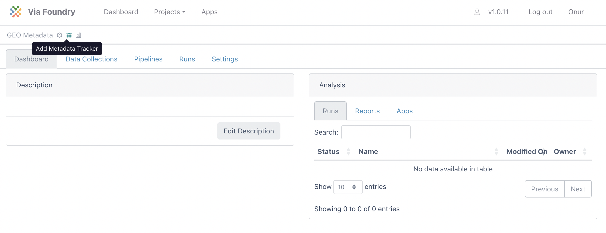

1. Click on `Metadata` tab. This window is the `Data View` section of the Metadata tracker where you will insert your data. Before inserting new data, we need to configure the database structure. To start configuring click on "Configure Metadata" button at the right. 

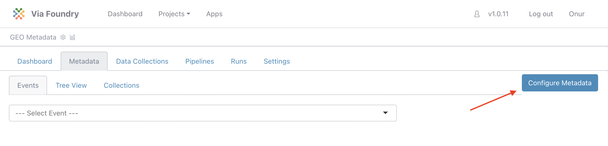

Configuring Metadata Tracker
========

2. In this configuration window there are couple of tabs available.
   - All Collections: List of project collections(tables).
   - All Events: List of events that are defined for Data view.
   - Tree View: Shows your project collections(tables) in tree visualization.
   - Templates: Predefined collections templates to import into your project

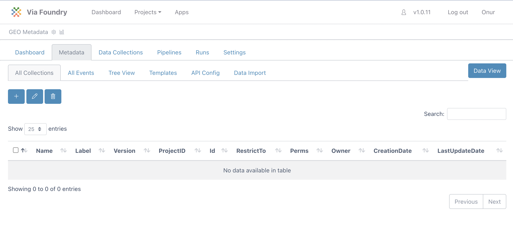

3. Please click `Templates` tab to import predefined collections. Select all the collections by clicking checkboxes. After choosing them, click `Import Collection` Button.

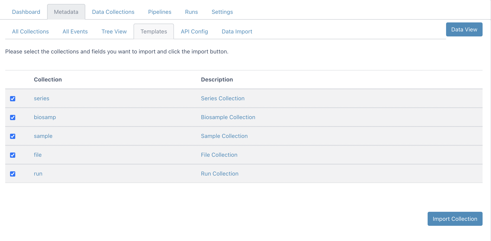


4. Now you can revisit `All Collections` and `Tree View` Tabs to see imported collection and their relationships.

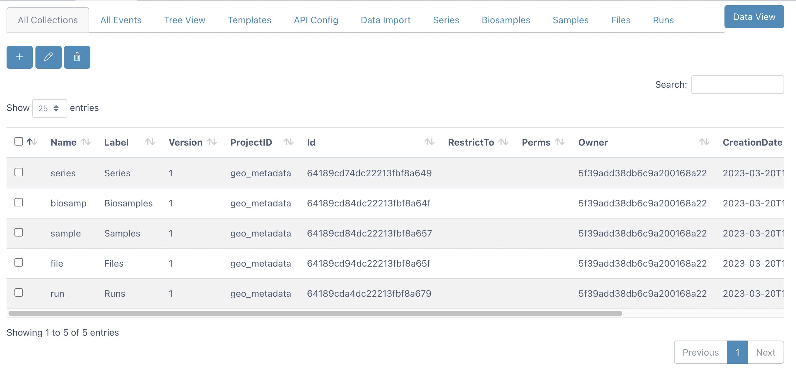
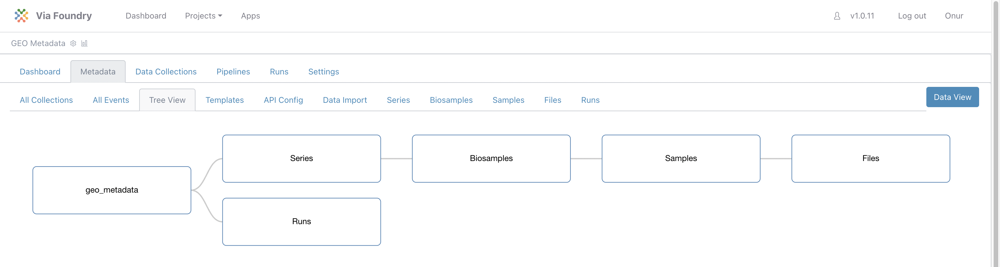

5. Let visit NCBI SRA Run Selector (https://www.ncbi.nlm.nih.gov/Traces/study/) to download sample project metadata. Enter `GSE196908` into `Accession` field and click search button.

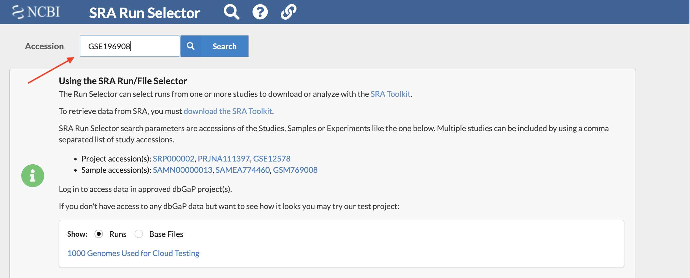

6. Click on the `Metadata` button to download comma separated metadata file. 
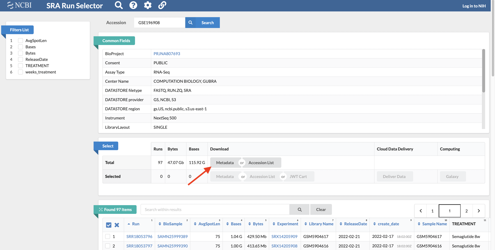

7. To visualize the file in excel or another spreadsheet viewer, change the file extension to csv.
   ``` 
   SraRunTable.txt -> SraRunTable.csv
   ```

8. Open the file to check its content.

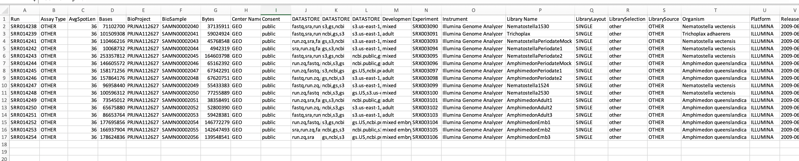

9. Lets distribute these column headers into 4 groups (series, biosamples, samples, file) to save into our project.

| series      | biosamples        | samples        |  files    |
| :----:      |    :----:         |    :----:      |  :----:   |
| BioProject  | BioSample         | Sample Name    |    Run    |
|             | Organism          | Assay Type     |    |
|             | source_name       | Library Name   |   |
|             | TREATMENT         | LibraryLayout      |   |
|             | weeks_treatment   | LibrarySelection      |    |
|             |                   | LibrarySource     |    |
|             |                   | Instrument     |    |
|             |                   | Platform       |    |


10. Return back to Foundry Metadata tracker, and click the Series tab. To use `name` column as identifier, change the `NamingPattern` of `id` column as follows:

| Column      | Field of change        | Old Value        |  New Value        | 
| :----:      |    :----:              |    :----:      |   :----:      | 
| id          | NamingPattern          | ```SE-${AUTOINCREMENT}```  | ```${series.name}```    |  


11. Similarly, to make `name` column a identifier for biosamples, click on Biosamples Tab and change the `NamingPattern` of `id` column as follows: 

| Column      | Field of change        | Old Value        |  New Value        | 
| :----:      |    :----:              |    :----:      |   :----:      | 
| id          | NamingPattern          | ```B-${AUTOINCREMENT}```  | ```${biosamp.name}```    |  

12. Insert new columns by clicking plus button at the top left.

| New Column Name      | New Column Label       | 
| :----:      |    :----:              |    
| Organism          | Organism          | 
| source_name          | source_name          | 
| TREATMENT          | TREATMENT          | 
| weeks_treatment          | weeks_treatment          | 

Enter new name and label values using the table above and click save button. You can see the example for `Organism` column below.

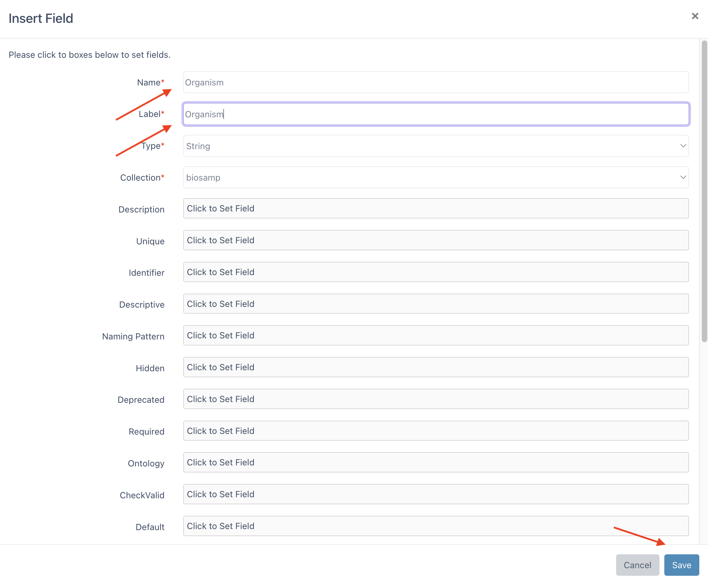

This should create the following database structure:

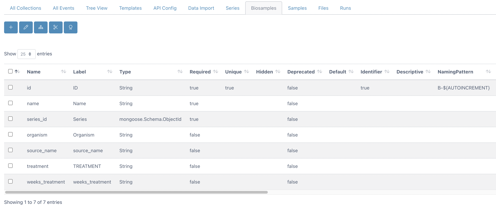

13. Click Samples Tab and change the `NamingPattern` of `id` column as follows: 

| Column      | Field of change        | Old Value        |  New Value        | 
| :----:      |    :----:              |    :----:      |   :----:      | 
| id          | NamingPattern          | ```SA-${AUTOINCREMENT}```  | ```${sample.name}```    |  

14. Insert new columns by clicking plus button at the top left. Enter new name and label values using the table below.

| New Column Name      | New Column Label       | 
| :----:      |    :----:              |    
| Assay Type            | Assay Type            | 
| LibraryLayout          | LibraryLayout          | 
| LibrarySelection          | LibrarySelection          | 
| LibrarySource          | LibrarySource          | 
| Instrument          | Instrument          | 
| Platform          | Platform          | 

Expected database structure of sample collection:

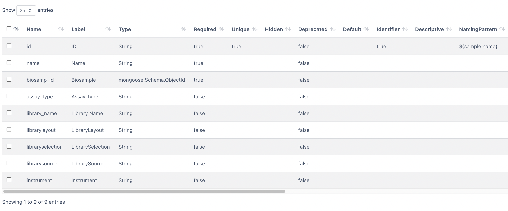

15. Click Files Tab and change the `NamingPattern` of `id` column as follows: 

| Column      | Field of change        | Old Value        |  New Value        | 
| :----:      |    :----:              |    :----:      |   :----:      | 
| id          | NamingPattern          | ```F-${AUTOINCREMENT}```  | ```${file.name}```    | 


16. Now we're ready to insert metadata. Click on "Data View" Button. 

Importing Metadata
========

17. Click `Collections` Tab and select `Series` Collection from dropdown. 

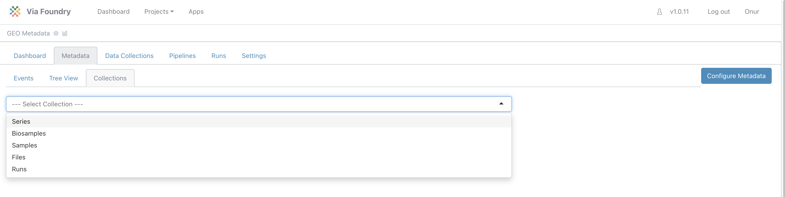

18. Click on `Insert` button to enter `PRJNA807693` into name field using form. After that click save button. 

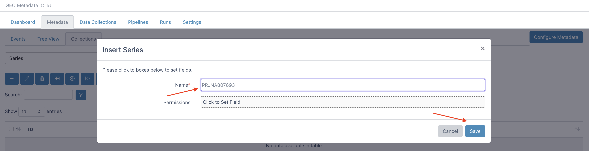

19. Go to collection dropdown and change its value to `Biosamples`. Click `Download Last Viewed Page as Excel file` button. You will see empty excel sheet with table headers. 

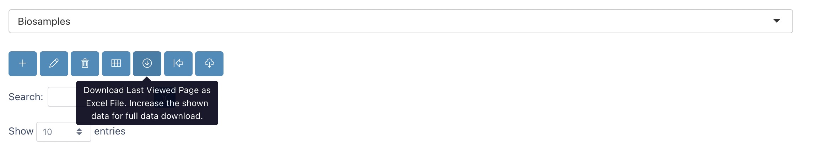
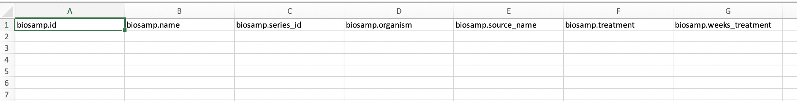

20. Copy and paste the data in SraRunTable into this empty sheet as follows:

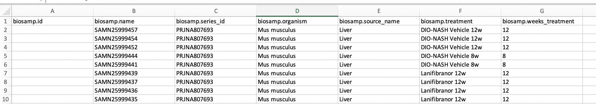

```
Note: `BioSample` column in SraRunTable is copied to `Name` column.
```

21. After saving this file, click on `Import on Excel File` button. Drag and drop your Biosamples.xlsx file and click `Load Table` button.

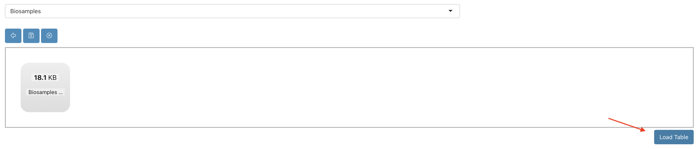

22. It will show the rows that are going to be inserted/updated in yellow color. Click Save button at the top left.

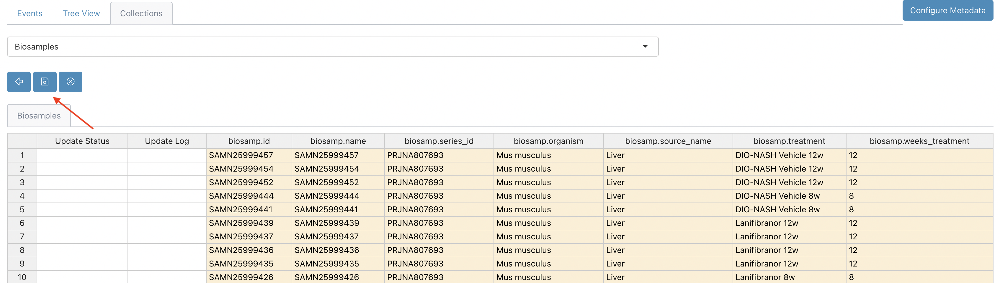

23. It will insert the rows as follows and status of the operation will be shown at the left side.

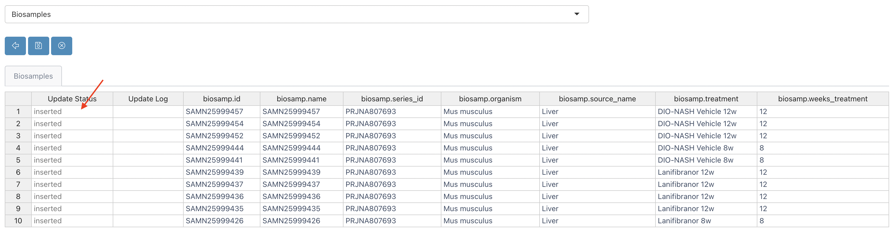

24. Now you can return to table view by clicking the button below:

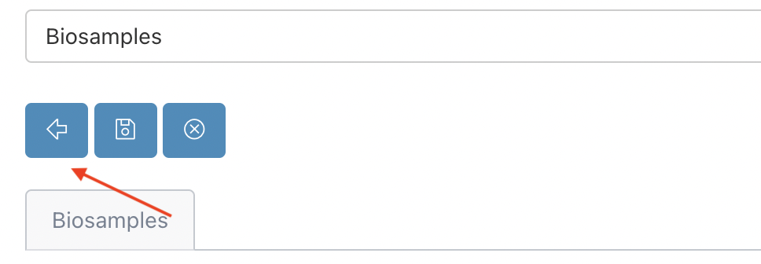 

25. Switch to `Samples` collection by using collection dropdown. Similar to biosamples collection, click `Download Last Viewed Page as Excel file` button. Copy and paste the data in SraRunTable into this empty sheet as follows:

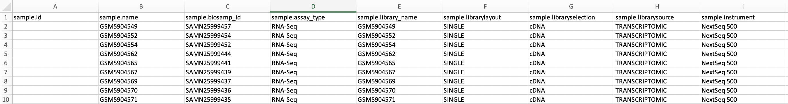

```
Note: `Sample Name` column in SraRunTable is copied to `Name` column.
```

26. After saving this file, click on `Import on Excel File` button. Drag and drop your Samples.xlsx file and click `Load Table` button. Now you're ready to import sample data with save button. Return back to table view by clicking `Show Table Format` button.

27. Go to collection dropdown and change its value to `Files`. Click `Download Last Viewed Page as Excel file` button. Copy and paste the data in SraRunTable into this empty sheet as follows:

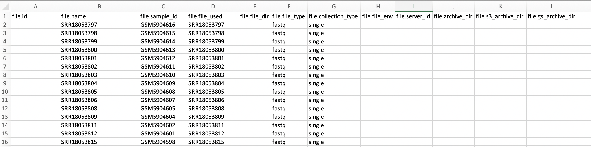


Congratulations! You have configured metadata tracker for your project and imported GEO data into foundry!
