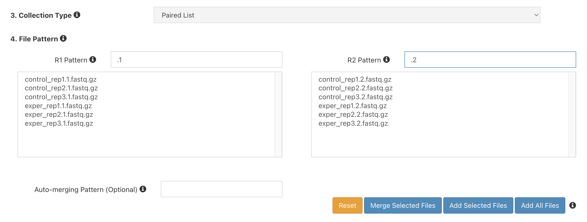
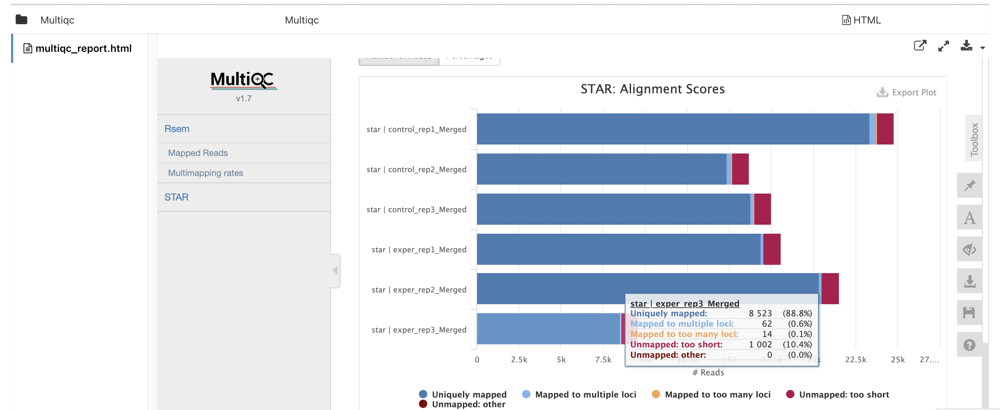

Expected learning outcome
========

To understand the basics of Metadata Tracking System, and import sample GEO metadata.

# Before you start

Please go to https://www.viafoundry.com and login into your account. If you have an issue about login, please let us know about it (support@viascientific.com). We will set an account for you.

Creating a Run
========

Once logged in, click on the `Projects` section at the top menu and click `Add a New Project` button. Enter your project name and click OK. This is the place to configure your project. Click on the `Add Metadata Tracker` icon to add new `Metadata` tab into your project. 


1. Click on `Metadata` tab. This window is the `Data View` section of the Metadata tracker where you will insert your data. Before inserting new data, we need to configure the database structure. To start configuring click on "Configure Metadata" button at the right. 


2. In this configuration window there are couple of tabs available.
   - All Collections: List of project collections(tables).
   - All Events: List of events that are defined for Data view.
   - Tree View: Shows your project collections(tables) in tree visualization.
   - Templates: Predefined collections templates to import into your project


3. Please click `Templates` tab to import predefined collections. Select all the collections by clicking checkboxes. After choosing them, click `Import Collection` Button.


4. Now you can revisit `All Collections` and `Tree View` Tabs to see imported collection and their relationships.


5. Let visit NCBI SRA Run Selector (https://www.ncbi.nlm.nih.gov/Traces/study/) to download sample project metadata. Enter `GSE196908` into `Accession` field and click search button.


6. Click on the `Metadata` button to download comma separated metadata file. 


3. Run page will be loaded. Under Run Environment, select "Via Demo Environment(AWS Batch)"
4. Under User Inputs, next to `reads`, click `Enter File`
5. Click `Add File` button to enter new files.
6. Next to "1. File Location", enter:
```
s3://viascientific/run_data/test_data/fastq_mouse
```
7. and click the magnifying glass icon. The box below should populate with files like so:


8. Next to `3. Collection Type`, choose `Paired List`
9. Under `4. File Pattern`, next to `Forward Pattern`, type `.1`. Similarly,  type `.2` for `Reverse Pattern`.



10. Click `Add All Files` button. You should now see 6 entries below.


11. Next to `5. Collection Name`, type `rna-seq mousetest paired` and Click `Save Files`
12. On the "Select/Add Input File" screen which should now have 6 entries, click "Save".
13. For "mate", choose "pair"
14. For genome_build, choose "mousetest"
15. Leave the rest as defaults
16. Click Run in the top right. RNA-Seq pipeline runs typically take several minutes to complete for this dataset.
17. Navigate to the Log tab and click on log.txt to see progress on your run.
18. Once the blue "Running" in the top right changes to a green "Completed" go to the Report tab to see the final reports.
19. Click on MulitiQC, and scroll to find this plot, which shows aligned reads per library:



20. Click on Summary to check mapping rates:


21. Click on RSEM Summary to download count table:


22. Click on DEBrowser to do Differential Expression Analysis.


Congratulations! You have run and tested a RNA-Seq pipeline on Foundry!
